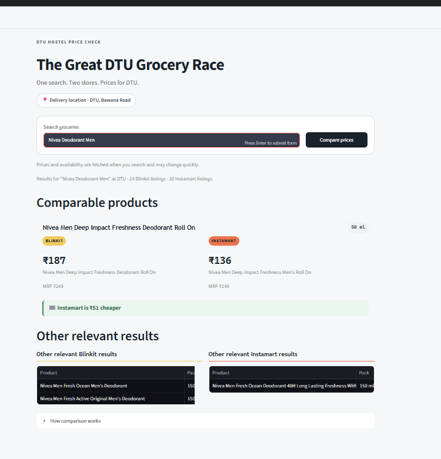
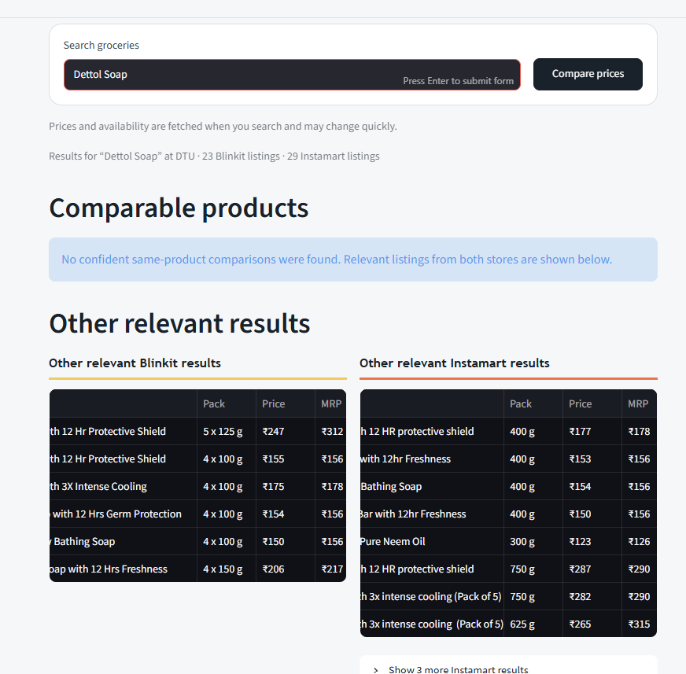

# The Great DTU Grocery Race

A local web app that searches Blinkit and Instamart in one request, fixes delivery to Delhi Technological University (DTU), and presents conservative like-for-like grocery price comparisons.

The submission intentionally optimizes for correctness and explainability over maximum match count. When two listings might be different sellable SKUs, the app keeps them separate under **Other search results** instead of forcing a potentially misleading comparison.

## Screenshots

### Confident same-SKU price comparison

The app shows the original titles from both marketplaces, normalized pack size, current prices, and the exact saving without exposing internal matching scores.



### Conservative handling of ambiguous products

When descriptions or pack structures do not align confidently, the app avoids a potentially misleading comparison and keeps the listings under the provider-specific search results.



## What the app does

1. Accepts a grocery query such as `Maggi`, `Amul butter`, `Coke`, or `Surf Excel Matic Liquid 1L`.
2. Opens both public desktop marketplaces with Playwright.
3. Selects the DTU Bawana Road/Rohini campus through each site's normal location UI.
4. Searches both providers in parallel and parses up to 30 rendered product cards per provider.
5. Normalizes titles, quantities, units, prices, and pack structure.
6. Shows confident same-SKU price comparisons first, followed by other query-filtered marketplace results.

No login, private API, mobile app, CAPTCHA bypass, or product-detail-page scraping is used.

## Architecture

```text
Streamlit UI
    -> ComparisonService (parallel calls, cache, failure isolation)
        -> BlinkitProvider ----\
        -> InstamartProvider ---+-> normalized Product[]
                                    -> deterministic SKU matcher
                                    -> query relevance filter/ranker
                                    -> SearchOutcome -> UI
```

Marketplace-specific navigation and selectors stay inside `providers/`. Everything downstream operates on shared Pydantic models. SKU identity and query relevance are deliberately separate: two listings can be the same SKU but irrelevant to the user's query, while two relevant listings can still be different SKUs.

## Prerequisites

- Python 3.11
- A working desktop session with internet access
- Chromium installed through Playwright

The app was developed with Python 3.11.7. A fresh virtual environment is recommended.

## Setup and run

### Windows PowerShell

```powershell
python -m venv .venv
.\.venv\Scripts\Activate.ps1
python -m pip install --upgrade pip
python -m pip install -r requirements.txt
python -m playwright install chromium
python -m streamlit run app.py
```

### macOS or Linux

```bash
python3.11 -m venv .venv
source .venv/bin/activate
python -m pip install --upgrade pip
python -m pip install -r requirements.txt
python -m playwright install chromium
python -m streamlit run app.py
```

Open the local URL printed by Streamlit, normally <http://localhost:8501>, enter a product, and select **Compare prices**.

On Linux, Chromium may require additional OS packages. If Playwright reports missing dependencies, run `python -m playwright install --with-deps chromium` where supported.

## Browser and location behavior

Each uncached provider search starts with a fresh isolated browser context and establishes DTU through the public UI. The project does **not** depend on cookies, `storage_state`, or a browser profile from the developer's machine.

- **Blinkit:** headed Chromium by default because the tested headless session was blocked. A temporary visible browser window is therefore expected; leave it open and the adapter will close it automatically.
- **Instamart:** headless Chromium by default.
- **Location:** Blinkit's chosen suggestion must include DTU, Bawana Road, and Rohini. Instamart's confirmation panel must include Bawana, Delhi Technological University, Rohini, and `110042`, followed by a confirmed DTU address-line check.

Optional diagnostic overrides:

```powershell
$env:BLINKIT_HEADLESS = "true"
$env:INSTAMART_HEADLESS = "false"
```

Blinkit headless mode is not recommended for the current site behavior.

## Tests

All normal tests are offline and do not contact either marketplace:

```powershell
python -m pytest -q
```

Current result: **63 passing tests**. Coverage includes card-text parsing, quantity and unit normalization, strict pack compatibility, title scoring, deduplication, mutual-best ambiguity handling, query relevance, explicit query quantities, caching, and one-provider failure isolation.

Live marketplace tests are intentionally excluded from `pytest`: availability, latency, anti-automation behavior, and DOM markup are external and volatile.

## Important behavior and limitations

- The scope is one fixed delivery area: DTU, Bawana Road/Rohini. There is no user-facing location selector.
- Successful provider results are cached in memory for three minutes; failures for 30 seconds. Restarting Streamlit clears the cache.
- Quantity is a hard SKU constraint. `500 g` equals `0.5 kg`, but `150 g` is not treated as the same SKU as `3 x 50 g`.
- Missing or unparseable quantities are never accepted as confident SKU matches.
- Matching is deterministic and dictionary-free: no hardcoded brand/flavour catalogue, LLM, or embeddings.
- Conservative thresholds can create false negatives when titles use aliases, omit variants, or describe bundles inconsistently.
- Query relevance is lightweight lexical filtering, not a full semantic search engine. If no query token is observed in the returned corpus, results are preserved rather than aggressively filtered; this can help with aliases and alternate marketplace naming.
- Unit-price comparison across different pack structures is intentionally out of scope because it requires a second, looser product-family decision.
- DOM changes, network timeouts, provider blocks, or location-flow changes can break an adapter. Failures are isolated so the other provider can still return results.
- This is a local assessment MVP and should not be publicly deployed or used for high-volume collection.

## Project structure

```text
app.py                    Streamlit presentation and session state
models.py                 Shared Pydantic domain models
service.py                Parallel orchestration, cache, failure isolation
relevance.py              Query filtering and relevance ordering
providers/                Marketplace navigation and card parsing
matching/normalize.py     Title and quantity normalization
matching/matcher.py       Conservative cross-provider SKU resolution
tests/                    Offline deterministic tests
DESIGN.md                 One-page submission design note source
```

See [DESIGN.md](DESIGN.md) for the submission design note.
